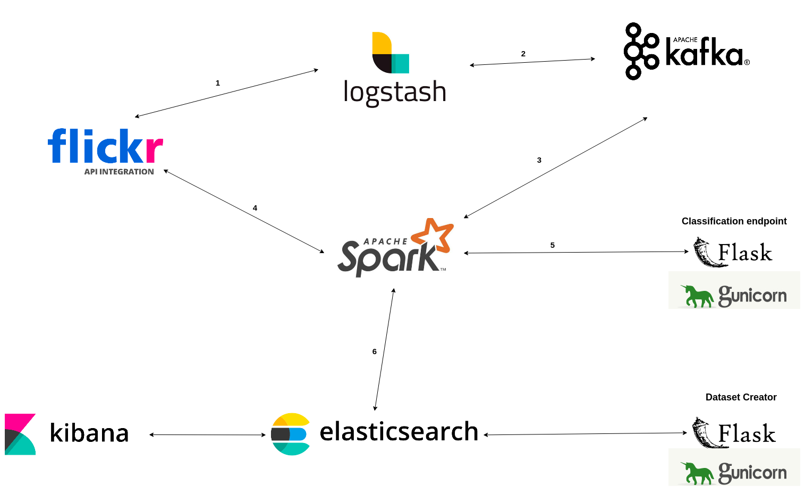

# Real-time Image Classifier, Trends Analyzer, and Dataset Creator

This is the project realized for the exam of the subject "Sistemi Cloud e IoT" (University of Catania, Computer Science Department).

# Architecture

The application above will run on a 3 Azure VMs cluster, in a user-created Kubernetes cluster of 3 nodes (1 master, 2 workers). Calico in VXLAN mode will be used by K8s as networking plugin.

Every component of the picture above will run in a different pod. (There is also another component not shown in the schema above, zookeeper, needed by kafka. This will run in a separte pod as well).

The master host will also host a local Docker registry where most of the Docker images (the custom ones) this project is made up of will be pushed, and downloaded as needed by worker nodes. This registry will only be reachable by hosts in the same Azure vnet as master host's one.

# Disclaimer

<b><h3>This product uses the Flickr API but is not endorsed or certified by SmugMug, Inc.</h3></b>
<h4>I'm not responsible for misuse of this project.</h4>
I also strongly recommend to read the Flickr APIs Terms of Use in order to be aware of what is possible to do and what is not possible to do with Flickr APIs and the data collected through them.

# How to start this project?

1. Install Azure CLI and do login.
2. Set FLICKR_API_KEY and FLICKR_API_SECRET env variables value in config.sh file.
3. Run './create_cluster_and_deploy_project.sh' command in main folder.
4. Enjoy!

If you want to customize clusters settings, edit <b>azure_cluster_management/cluster_config.sh</b> and <b>config.sh</b> files before executing the 3rd point of the list above.

# How to stop this project?
Simply execute azure_cluster_management/destroy-azure-cluster.sh script.

<b>N.B.:</b> This will destroy all Azure cluster resources created by create_cluster_and_deploy_project.sh script.

# How to query Dataset Creator microservice?

You can use the following url template:  

http://\<master-host-public-ip\>:8081/getDataset?class=\<class-id\>&max=\<max-urls-to-retrieve\>&min_conf=\<min-confidence-score-the-assigned-class-must-have-to-add-url-in-output-list\>

To get the full list of available class ids visit:

http://\<master-host-public-ip\>:8081/getClasses 

<b>N.B.:</b>
- master-host-public-ip will be printed at the end of the execution of create_cluster_and_deploy_project.sh script. However, you can always retrieve it by exectuing the script azure_cluster_management/get-cluster-hosts-IPs.sh. 

- Confidence score is a decimal number in [0.0, 1.0].

  - Setting it to a negative number would cause images with whatever class confidence score to be included in the output list.  
  - Setting it to a number greater than 1.0 would lead to an empty output list.

# How to access Kibana GUI?
  
Simply visit:

http://\<master-host-public-ip\>:5601

# How to ssh into created VMs?

Just type in a shell "ssh \<vm-name\>".

<b>N.B.:</b>
- VM names can be found:
  
  - in config.sh file, in the HOSTS array.
  - in azure_cluster_management/cluster_config.sh, in the HOSTNAMES array.
  - by simply typing "cat ~/.ssh/config" in a shell.
